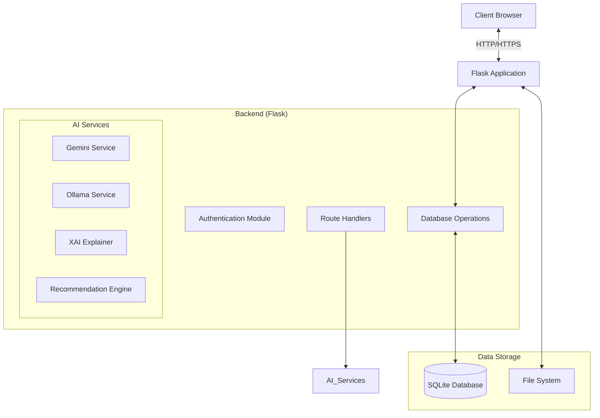
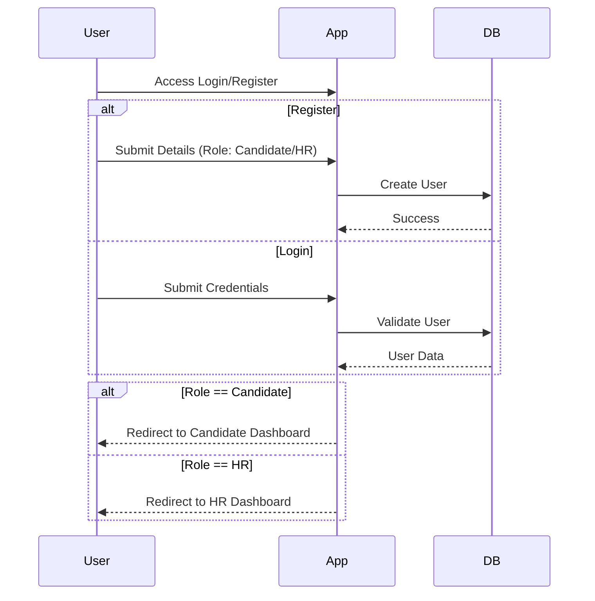
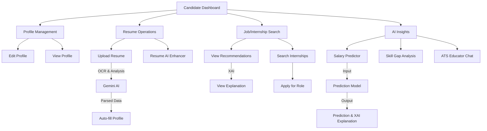
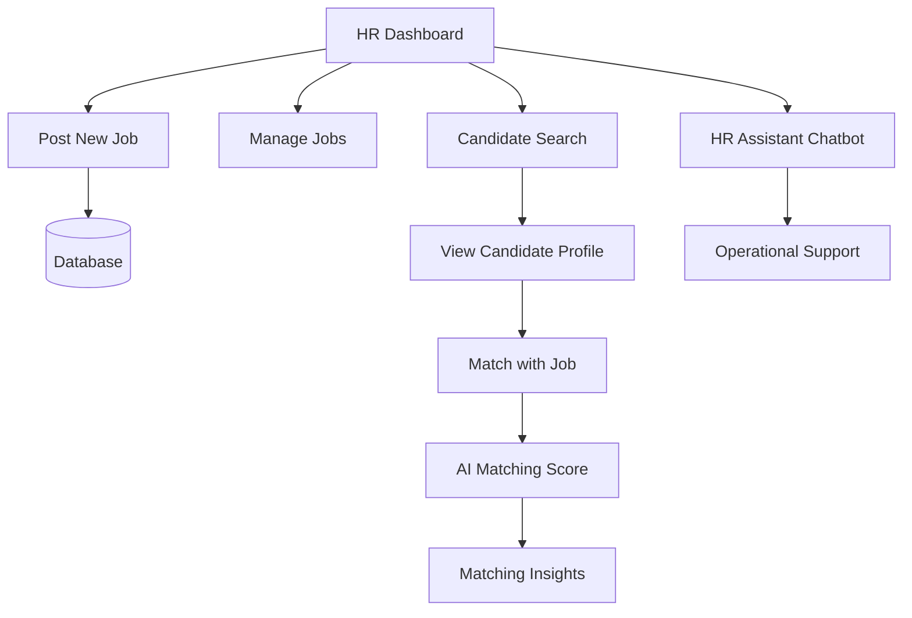
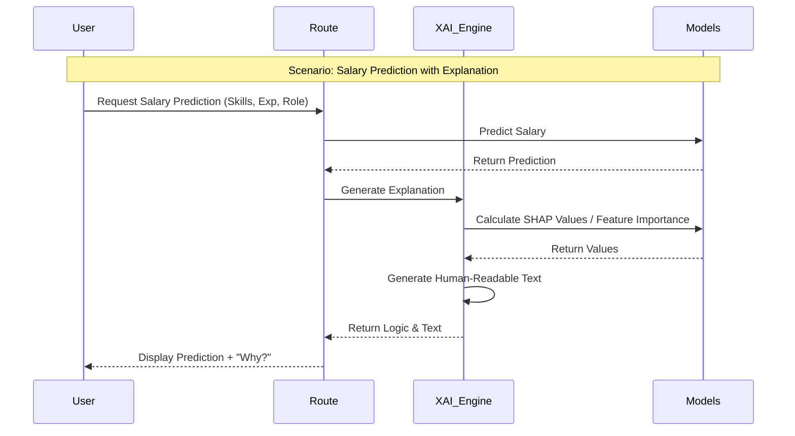
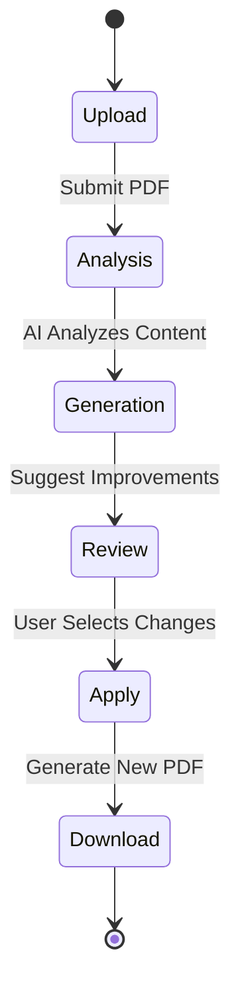

# Application Workflow & Architecture

This document provides a visual overview of the Internship Recommender System, including user flows, system architecture, and AI integration points.

## 1. System Architecture

The application follows a standard Model-View-Controller (MVC) pattern adapted for Flask.

## 2. Authentication & User Roles

## 3. Candidate Workflow

Comprehensive flow for a candidate user, from profile creation to job application.

## 4. HR Workflow

Flow for HR users to manage jobs and candidates.

## 5. XAI & AI Integration Pipeline

Detailing how the Explainable AI (XAI) and other AI components function.

## 6. Resume Enhancement Flow

